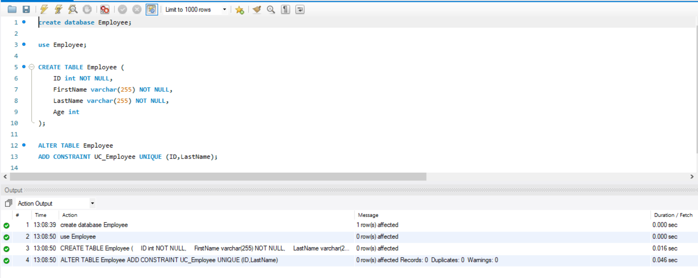
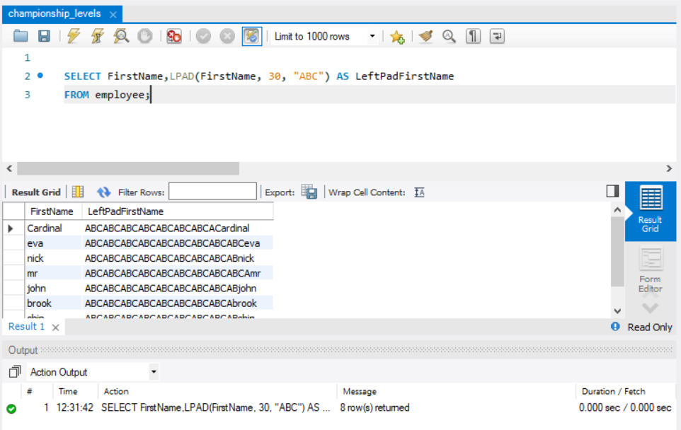
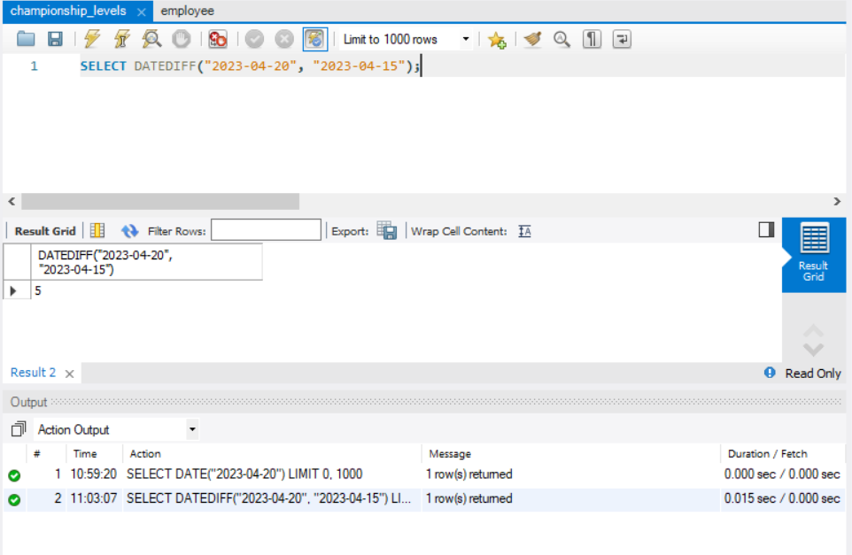
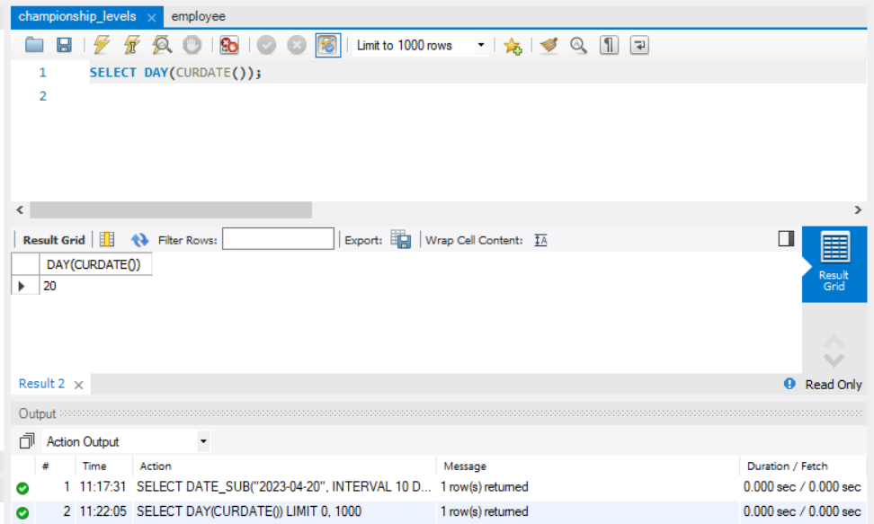
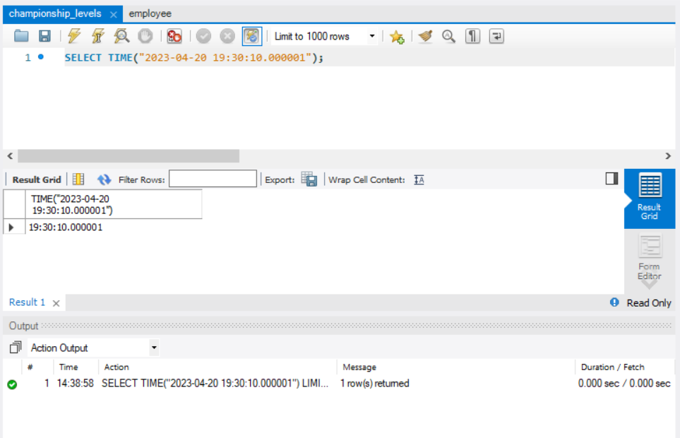

# MYSQL
<br>


## Introduction to MySQL
<br>


<br>


<div style="font-size:20px; text-align:justify;"> 

{{1}} [What is Database](#what-is-database)

{{2}} [What is MySQL](#what-is-mysql)

{{3}} [What is MySQL RDMS](#mysql-rdbms)

{{4}} [MySQL SQL](#mysql-sql)

{{5}} [WorkBench Installation](#installation-of-mysql-workbench)

</div>

### What is Database 
<br>

* A database is an organized collection of structured information, or data, typically stored electronically in a computer system. 

* Databases make data management easy

* A database is usually controlled by a database management system (DBMS).
<br>


<br>


### What is MySQL  
<br>

* MySQL is a relational database management system

* MySQL is free and open-source.

* MySQL is ideal for both small and large applications

* MySQL is very fast, reliable, scalable, and easy to use

* MySQL is cross-platform

* MySQL is compliant with the ANSI SQL standard
<br>

**Who Uses MySQL**

<br>

* Huge websites like Facebook, Twitter, Airbnb, Booking.com, Uber, GitHub, YouTube, etc.

* Content Management Systems like WordPress, Drupal, Joomla!, Contao, etc.

* A very large number of web developers around the world

### MySQL RDBMS
<br>

**What is RDBMS**

* RDBMS stands for Relational Database Management System.

* RDBMS is a program used to create, update, and manage relational databases.

* Some of the most well-known RDBMSs include MySQL, PostgreSQL, MariaDB, Microsoft SQL Server, and Oracle Database.

* RDBMS uses SQL queries to access the data in the database.
<br>

"A relational database defines database relationships in the form of tables. The tables are related to each other - based on data common to each. Look at the following two tables "Customers" and "Orders",The relationship between the "Customers" table and the "Orders" table is the CustomerID column"
<br>

### MySQL SQL
<br>

**What is SQL**

* SQL is used to communicate with a database.

* According to ANSI (American National Standards Institute), it is the standard language for relational database management systems.

* SQL statements are used to perform tasks such as update data on a database or retrieving data from a database.

<br>
**Some of The Most Important SQL Commands** :

* SELECT - extracts data from a database
* UPDATE - updates data in a database
* DELETE - deletes data from a database
* INSERT INTO - inserts new data into a database
* CREATE DATABASE - creates a new database
* ALTER DATABASE - modifies a database
* CREATE TABLE - creates a new table
* ALTER TABLE - modifies a table
* DROP TABLE - deletes a table
* CREATE INDEX - creates an index (search key)
* DROP INDEX - deletes an index

### Installation of MySQL WorkBench

**Steps to install MySQL**:

{{1-7}} 
> **Step 1**: Click on the link : (https://dev.mysql.com/downloads/)

{{2-7}} 
> **Step 2**: Select MySQL Installer for Windows 
>

{{3-7}} 
> **Step 3**: Download MySQL Installer web community 2.4 M 
>

{{4-7}} 
> **Step 4**: click on No thanks, just start my download.
>

{{5-7}} 
> **Step 5**: click on the downloaded file.

{{6-7}}
> **Step 6**: setting up the Workbench
>(https://www.youtube.com/watch?v=YSOY_NyOg40)


## Data Types
<br>
An SQL developer must decide what type of data will be stored inside each column when creating a table. The data type is a guideline for SQL to understand what type of data is expected inside of each column, and it also identifies how SQL will interact with the stored data.

<br>
In MySQL there are three main data types: text, number, and date and time.

* [Text data types](#text-data-types)

* [Number data Types](#number-data-types)

* [Date data types](#date-data-types)

<br>


<br>

###	Text data types

<br>

| **_Data Type_** | **_Description_**                          |
|-----------------|--------------------------------------------|
|CHAR(size)       |Holds a fixed length string (can contain letters, numbers, and special characters). The fixed size is specified in parenthesis.Can store up to 255 characters|
|VARCHAR(size)    |Holds a variable length string (can contain letters, numbers, and special characters). The maximum size is specified in parenthesis.Can store up to 255 characters. Note: If you put a greater value than 255 it will be converted to a TEXT type|
|TINYTEXT         |Holds a string with a maximum length of 255 characters|
|TEXT             |Holds a string with a maximum length of 65,535 characters|
|BLOB             |For BLOBs (Binary Large OBjects). Holds up to 65,535 bytes of data|
|MEDIUMTEXT       |Holds a string with a maximum length of 16,777,215 characters|
|MEDIUMBLOB       |For BLOBs (Binary Large OBjects). Holds up to 16,777,215 bytes of data|
|LONGTEXT         |Holds a string with a maximum length of 4,294,967,295 characters|
|LONGBLOB         |For BLOBs (Binary Large OBjects). Holds up to 4,294,967,295 bytes of data|


###	Number data Types
<br>

<!-- data-transpose data-type="none" -->
| **_Data Type_** | **_Description_**                          | **_Lower limit_**                   | **_Upper limit_**                    | **_Memory_**       |
|-----------------|--------------------------------------------|-------------------------------------|--------------------------------------|--------------------|
| bigint          | It stores whole numbers in the range given | −2^63 (−9,223,372, 036,854,775,808) | 2^63−1 (9,223,372, 036,854,775,807)  | 8 bytes            |
| int             | It stores whole numbers in the range given | −2^31 (−2,147, 483,648)             | 2^31−1 (2,147, 483,647)              | 4 bytes            |
| smallint        | It stores whole numbers in the range given | −2^15 (−32,767)                     | 2^15 (32,768)                        | 2 bytes            |
| tinyint         | It stores whole numbers in the range given | 0                                   | 255                                  | 1 byte             |
| decimal         | Used for scale and fixed precision numbers | −10^38+1                            | 10^381−1                             | 5 to 17 bytes      |
| float           | Used for a floating precision number       | −1.79E+308                          | 1.79E+308                            | 7 bytes            |
| double          | A large number with a floating decimal point| −3.40E+38                          | −3.40E+38                            | 15 bytes           |
| meduimint       | It stores whole numbers in the range given  | −8,388,608                           | +8,388,608                         | 3 bytes            |

###	Date data types


| **_Data Type_** | **_Description_**                          |
|-----------------|--------------------------------------------|
|DATE()           |A date. Format: YYYY-MM-DD **Note**: The supported range is from '1000-01-01' to '9999-12-31'|
|DATETIME()       |A date and time combination. Format: YYYY-MM-DD HH:MI:SS **Note**: The supported range is from '1000-01-01 00:00:00' to '9999-12-31 23:59:59'|
|TIMESTAMP()      |A timestamp. TIMESTAMP values are stored as the number of seconds since the Unix epoch ('1970-01-01 00:00:00' UTC). Format: YYYY-MM-DD HH:MI:SS **Note**: The supported range is from '1970-01-01 00:00:01' UTC to '2038-01-09 03:14:07' UTC|
|TIME()           |A time. Format: HH:MI:SS **Note**: The supported range is from '-838:59:59' to '838:59:59'|
|YEAR()           |A year in two-digit or four-digit format.**Note**: Values allowed in four-digit format: 1901 to 2155. Values allowed in two-digit format: 70 to 69, representing years from 1970 to 2069|


## Constraints

* MySQL CONSTRAINT is used to define rules to allow or restrict what values can be stored in columns. The purpose of inducing constraints is to enforce the integrity of a database.

* MySQL CONSTRAINTS are used to limit the type of data that can be inserted into a table.

* MySQL CONSTRAINTS can be classified into two types - column level and table level.

* The column-level constraints can apply only to one column where as table-level constraints are applied to the entire table.

* MySQL CONSTRAINT is declared at the time of creating a table.

**MySQL CONSTRAINTs are** : 

* [NOT NULL](#not-null)

* [UNIQUE](#unique)

* [PRIMARY KEY](#primary-key)

* [FOREIGN KEY](#foreign-key)

* [DEFAULT](#default)

### NOT NULL

* The NOT NULL constraint enforces a column to NOT accept NULL values.

* This enforces a field to always contain a value, which means that you cannot insert a new record, or update a record without adding a value to this field.

**Not NULL on Creating a Table**:-

```markdown

CREATE TABLE Employee (
    ID int NOT NULL,
    FirstName varchar(255) NOT NULL,
    LastName varchar(255) NOT NULL,
    Age int
);
```
**Output**:


### UNIQUE

* The UNIQUE constraint ensures that all values in a column are different.

* Both the UNIQUE and PRIMARY KEY constraints provide a guarantee for uniqueness for a column or set of columns.

* A PRIMARY KEY constraint automatically has a UNIQUE constraint.

* However, you can have many UNIQUE constraints per table, but only one PRIMARY KEY constraint per table.

```markdown

CREATE TABLE Employee (
    ID int NOT NULL,
    FirstName varchar(255) NOT NULL,
    LastName varchar(255) NOT NULL,
    Age int ,
    UNIQUE (ID)
);

```

**Output**:


#### Multiple Unique Constraints

* To name a UNIQUE constraint, and to define a UNIQUE constraint on multiple columns, use the following SQL syntax

```markdown

CREATE TABLE Employee (
    ID int NOT NULL,
    FirstName varchar(255) NOT NULL,
    LastName varchar(255) NOT NULL,
    Age int ,
    CONSTRAINT UC_Employee UNIQUE (ID,LastName)
);
```

**Output**:


#### Unique Constraints on Alter Table

* To create a UNIQUE constraint on the "ID" & "LastName" column when the table is already created, use the following SQL

```markdown

ALTER TABLE Employee
ADD CONSTRAINT UC_Employee UNIQUE (ID,LastName);


```

**Output**:




#### Drop a Unique  Constraint

To drop a UNIQUE constraint, use the following MySQL:

```markdown

ALTER TABLE Employee
DROP INDEX UC_Employee;

```

**Output**:


### PRIMARY KEY

* The PRIMARY KEY constraint uniquely identifies each record in a table.

* Primary keys must contain UNIQUE values, and cannot contain NULL values.

* A table can have only ONE primary key; and in the table, this primary key can consist of single or multiple columns (fields).

```markdown

CREATE TABLE Employee (
    ID int NOT NULL,
    FirstName varchar(255) NOT NULL,
    LastName varchar(255) NOT NULL,
    Age int ,
    PRIMARY KEY (ID)
);

```
**Output**:


#### Multiple Primary Constraints

To allow naming of a PRIMARY KEY constraint, and for defining a PRIMARY KEY constraint on multiple columns, use the following SQL syntax:

```markdown
CREATE TABLE Employee (
    ID int NOT NULL,
    FirstName varchar(255) NOT NULL,
    LastName varchar(255) NOT NULL,
    Age int ,
   CONSTRAINT PK_Employee PRIMARY KEY (ID,LastName)
);

```
**Output**:


#### primary Constraints on Alter Table

To create a PRIMARY KEY constraint on the "ID" column when the table is already created, use the following SQL:

```markdown
ALTER TABLE Employee
ADD PRIMARY KEY (ID);

```


**Output**:


#### Drop a primary  Constraint

To drop a PRIMARY KEY constraint, use the following MySQL:

```markdown
ALTER TABLE Employee
DROP PRIMARY KEY;

```
**Output**:


### FOREIGN KEY

* The FOREIGN KEY constraint is used to prevent actions that would destroy links between tables.

* A FOREIGN KEY is a field (or collection of fields) in one table, that refers to the PRIMARY KEY in another table.

* The table with the foreign key is called the child table, and the table with the primary key is called the referenced or parent table.

**Employee Table**:-

| **_EmployeeID_** | **_FirstName_**|**_LastName_**   | **_Age_** |
|------------------|----------------|-----------------|-----------|
| 1                | texas          | John            | 26        |
| 2                | Phoenix        | justin          | 25        |
| 3                | SpaceX         | elon            | 28        |


**Salary**:

| **_SalaryID_** | **_Salary_** | **_EmployeeID_** |
|----------------|--------------|------------------|
| 1              | 65000$       | 1                |
| 2              | 45000$       | 2                |
| 3              | 50000$       | 3                |

* Notice that the "EmployeeID" column in the "Salary" table points to the "EmployeeID" column in the "Employee" table.

* The "EmployeeID" column in the "Employee" table is the PRIMARY KEY in the "Employee" table.

* The "EmployeeID" column in the "Salary" table is a FOREIGN KEY in the "Salary" table.

* The FOREIGN KEY constraint prevents invalid data from being inserted into the foreign key column, because it has to be one of the values contained in the parent table.

#### Create Foreign key

```markdown
CREATE TABLE Salary (
    SalaryID int NOT NULL,
    Salary int NOT NULL,
    EmployeeID int,
    PRIMARY KEY (SalaryID),
    FOREIGN KEY (EmployeeID) REFERENCES Employee(ID)
);
```


**Output**:


#### foreign Constraints on Alter Table

```markdown
ALTER TABLE Salary
ADD FOREIGN KEY (EmployeeID) REFERENCES Employee(ID);

```
**Output**:


#### Drop a foreign  Constraint

```
ALTER TABLE Salary
DROP FOREIGN KEY FK_EmployeeSalary;

```

**Output**:


### DEFAULT

The following SQL sets a DEFAULT value for the "City" column when the "Persons" table is created:

```markdown

CREATE TABLE Employee (
    ID int NOT NULL,
    FirstName varchar(255) NOT NULL,
    LastName varchar(255) NOT NULL,
    Age int ,
    City varchar(255) DEFAULT 'US'
);

```

**Output**:


## Data Definition Language(DDL)

A data definition language (DDL) is a computer language used to create and modify the structure of database objects in a database. These database objects include views, schemas, tables, indexes, etc.

**Data Definition Laungauge Commands are as follows**

1. [CREATE](#create-command) 

2. [ALTER](#alter-command)

3. [DROP](#drop-command)

4. [TRUNCATE](#truncate-command)

### Create Command

create is a DDL SQL command used to create a table in a relational database management system.
The table creation command requires the following details −

*	Name of the table

*	Name of the fields(Column) 

*	Definitions for each field(Datatype)

Syntax:

```
/* to create database */
    CREATE DATABASE database_name;

    /* to create schema */
    CREATE SCHEMA schema_name;

    /* to create table */
CREATE TABLE <TABLE_NAME> 
	( 
		column_name1 datatype1, 
		column_name2 datatype2, 
		column_name3 datatype3, 
		column_name4 datatype4 
	);

```
Create Command Example

```
/* to create database */
CREATE DATABASE EmployeeManagement;

/* to create schema */
CREATE SCHEMA Employees;

/* to create table */
CREATE TABLE Employee (
    ID int NOT NULL,
    FirstName varchar(255) NOT NULL,
    LastName varchar(255) NOT NULL,
    Age int ,
   CONSTRAINT PK_Employee PRIMARY KEY (ID,LastName)
);
```
Output:


### Alter Command

Alter statement is used to add, delete or modify columns in an exisiting table

*	Add column

The basic syntax of an ALTER TABLE command to add a New Column in an existing table is as follows

Syntax:

```
    ALTER  TABLE table_name
	ADD column_name datatype;
```

Example:

```
ALTER TABLE Employee
ADD Email varchar(255);
```

Output:


#### Modify column

The basic syntax of an ALTER TABLE command to change the DATA TYPE of a column in a table is as follows.

Syntax:

```
ALTER  TABLE  table_name 
ALTER  COLUMN column_name  datatype;

```

Example:

```
ALTER TABLE Employee
ADD DateOfBirth date;

ALTER TABLE Employee
MODIFY COLUMN DateOfBirth year;

```

Output:


#### Delete column

The basic syntax of an ALTER TABLE command to DROP COLUMN in an existing table is as follows.

Syntax:

```
ALTER  TABLE table_name 
DROP  COLUMN column_name;

```

Example:

```
ALTER TABLE Employee
DROP COLUMN DateOfBirth;

```

Output:


### Drop Command

It is very easy to drop an existing MySQL table, but you need to be very careful while deleting any existing table because the data lost will not be recovered after deleting a table. 

Syntax:

```
DROP  TABLE  table_name;

```

Example:

```
DROP TABLE Employee


```

Output:


### Truncate Command

TRUNCATE command removes all the records from a table. But this command will not destroy the table's structure.

Syntax:

```
TRUNCATE TABLE table_name ;
```

Example:

```

TRUNCATE TABLE Employee ;

```
Output:


## Data Manipulation Lanaguage(DML)

The DML commands in Structured Query Language change the data present in the SQL database. We can easily access, store, modify, update and delete the existing records from the database using DML commands.

DML Commands are :

* [Insert Command](#insert-command)

* [Update Command](#update-command)

* [Delete Command](#delete-command)

### Insert Command

* The SQL INSERT INTO Statement is used to add new rows of data to a table in the database.

* Only one row is inserted with this syntax.

* Insert a new row containing values for each column.

* List values in the default order of the columns in the table.

* Optionally, list the columns in the insert clause.

* Enclose character and data values within single quotation marks.

It is possible to write the INSERT INTO statement in two ways:

1. Specify both the column names and the values to be inserted:

Syntax:

```
INSERT INTO table_name (column1, column2, column3, ...)
VALUES (value1, value2, value3, ...);

```

2. If you are adding values for all the columns of the table, you do not need to specify the column names in the SQL query. However, make sure the order of the values is in the same order as the columns in the table. Here, the INSERT INTO syntax would be as follows:

```
INSERT INTO table_name VALUES (value1, value2, value3, ...);
```

Example:

```
INSERT INTO Employee (ID,FirstName, LastName, Age)
VALUES (1,'Cardinal', 'Tom B. Erichsen', 21);

```

Output:


### Update Command

* The UPDATE Query is used to modify the existing records in a table.

* You can use the WHERE clause with the UPDATE query to update the selected rows, otherwise, all the rows would be affected.


Syntax:

```
UPDATE table_name 
SET column1 = value1, column2 = value2...., columnN = valueN 
WHERE [condition];

```
Example:

```
UPDATE Employee
SET FirstName = 'Alfred', LastName = 'Schmidt'
WHERE ID = 1;

```
Output:


### Delete Command

* The SQL DELETE Query is used to delete the existing records from a table.
* You can use the WHERE clause with a DELETE query to delete the selected rows, otherwise all the records would be deleted. 

Syntax:

```
DELETE FROM table_name 
WHERE [condition];

```
Example:

```
DELETE FROM Employee WHERE  ID = 1;

```

Output:


## Data Control Language

It is used to control privileges in Database. To perform any operation in the database, such as for creating tables, sequences or views, a user needs privileges.

The DCL statements are

1. [GRANT](#grant-command)

2. [REVOKE](#revoke-command)

### Grant Command

* It is used to provide any user access privileges or other privileges for the database

Syntax:

```
/* Grant read only to a User */
GRANT SELECT ON table_name TO user_name;

/* Grant insert,update,delete & select function to a user */
GRANT INSERT, UPDATE, DELETE, SELECT ON table_name TO user_name;

```

Example:

```

CREATE USER john@localhost IDENTIFIED BY 'jtp12345';

GRANT ALL ON employee.* TO john@localhost;

```


Output:


### Revoke Command

* It is used to take back the privileges from any user, use the REVOKE command.

Syntax:

```
REVOKE privilege_name(s)   
ON object   
FROM user_account_name;  

```
Example:

```
REVOKE ALL, GRANT OPTION FROM john@localhost;  

```

Output:


## Transaction Control Lanaguage(TCL)

Database Transactions:

A transaction begins with the first statement is encounterd and ends when one of the following occurs.This command is used to manage changes to DML statements.

* A commit or rollback statement is issued.

* A DDL statement, such as create is issued.

* A DCL statement is issued.

* The system crashes.

* After one transaction ends, the next executable SQL statement automatically starts the next transaction.

* A DDL statement or a DCL statement is automatically committed and therefore implicitly ends a transaction.

You can control the logic of transactions by using the

1. [Commit](#commit)

2. [Savepoint](#savepoint)

3. [Rollback](#rollback)

### Commit

* COMMIT command is used to permanently save any transaction into the database.

* When we use any DML command like INSERT, UPDATE or DELETE, the changes made by these commands are not permanent, until the current session is closed, the changes made by these commands can be rolled back.

* To avoid that, we use the COMMIT command to mark the changes as permanent.

Syntax:

```
COMMIT;

```

Example:

```
COMMIT;
```

Output:


### Savepoint

*	SAVEPOINT command is used to temporarily save a transaction so that you can rollback to that point whenever required.

Syntax:

```
	SAVEPOINT savepoint_name;

```

Example:

```

	SAVEPOINT transactionA;


```
Output:


### Rollback

* This command restores the database to last commited state. It is also used with SAVEPOINT command to jump to a savepoint in an ongoing transaction.
* If we have used the UPDATE command to make some changes into the database, and realise that those changes were not required, then we can use the ROLLBACK command to rollback those changes, if they were not commited using the COMMIT command.

Syntax:

```
ROLLBACK savepoint_name;
```

Example:

```
ROLLBACK to transactionA;

```
Output:


### Example for Commit, Savepoint and RollBack

```
create table student(id INT,name VARCHAR(20));
start transaction;
select * from student;
insert into student values(10,'Dravid');
savepoint transactionInsert;
insert into student values(20,'Sachin');
insert into student values(30,'Dhoni');
insert into student values(40,'kohli');
select * from student;
savepoint transactionDelete;
delete from student where id=10;
delete from student where id=20;
select * from student;
rollback to transactionDelete;
select * from student;
rollback to transactionDelete;
select * from student;
rollback;
select * from student;

```
Output:


## Data Query/Retrieval Language (DQL/DRL)

SELECT statement is used to retrieve the information from database using select statement you can do the following

* Projection: It is used to choose columns in a table that you want returned by the query.

* Selection: It is used to choose rows in a table that you want returned by your query.

* Joining: You can choose the join capability in SQL to bring together data that is stored in different tables by creating a link between them.

Syntax:

```
SELECT column1, column2, ...FROM table_name;

/* select all the fields available in the table */
SELECT * FROM table_name;

```

Example:

```
SELECT * FROM employee;

SELECT Id,first_name,last_name FROM employee.employees;

```

output:


### Arithmetic Expressions

* Create expressions with number and date data by using arithematic operators

* Operator Precedence : * , / , + , -

* If the operators within an expression are of same priority then evaluation is done from left to right.

Example:

```
SELECT ID,FirstName,LastName,salary,(20*salary-100)/2 FROM employee;

```

output:


### column aliases

* Renames column heading

* It is useful for calculations

* Immediately followed by the column name, there can also be optional keyword AS keyword betweeen the column name and alias.

* Enclose alias name in double quotations if it contains a special characters such as # or $ or is case sensitive.

* Column aliases can be used in both select clause and the order by clause you cannot use column aliases in where clause.

Syntax:

```
SELECT column_name AS alias_name
FROM table_name;

```
Example:

```
SELECT ID AS EmployeeID, FirstName  AS EmployeeName
FROM employee;
```

Output:


### Clause

1. [DISTINCT](#distinct)

2. [WHERE](#where)

3. [ORDER BY](#order-by)

4. [GROUP BY](#group-by)

5. [HAVING](#having)

#### DISTINCT

* The SQL DISTINCT keyword is used in conjunction with the SELECT statement to eliminate all the duplicate records and fetching only unique records.

* There may be a situation when you have multiple duplicate records in a table. While fetching such records, it makes more sense to fetch only those unique records instead of fetching duplicate records and can be used for more than one column

* Distinct keyword should be used immediately after the select keyword.

* Distinct can also be used with multiple columns and it affects all the columns selected

Syntax

```
SELECT DISTINCT column1, column2,.....columnN 
FROM table_name  WHERE [condition]
```

Example:

```
SELECT DISTINCT FirstName  
FROM employee; 

```

Output:


#### WHERE

* We restrict the rows returned by using the WHERE clause.

* Where restricts the query to rows that meets the condition

* Condition is composed of column names ,expressions constants ,and a comparison operator.

* Where consists of three elements.

1. column name 

2. comparison condition 

3. column name, constant or list of values

* Character strings and date values are enclosed in single quotation marks.

* The WHERE clause is not only used in the SELECT statement, but it is also used in the UPDATE, DELETE statement, etc.,


Syntax:

```	
	SELECT column1, column2,.....columnN 
FROM table_name 
WHERE [condition]

```

Example:

```
SELECT * FROM employee
WHERE ID = 1;

```


Output:


#### ORDER BY

* We sort rows by using order by clause .

1. ASC: ascending order , default

2. DSC: descending order.

* The order by clause comes last in the select statement.

* Order by clause is executed last in the query execution .it is placed last unless the for update clause is used.

* Default sorting is ascending

* Numeric values are displayed with lowest values first ex: 1-999

* Date values are displayed with earliest value first ex: 01-jan-92 before 01-jan-95.

* Character values are displayed in alphabetic order ex: A-Z.

* Null values are displayed last for ascending sequences and first for descending sequences.

* We can also sort by a column number in the select list.

Syntax:

```
SELECT column1, column2, ...
FROM table_name
ORDER BY column1, column2, ... ASC|DESC;

```

Example:

```
SELECT * FROM employee
ORDER BY salary;

```

Output:


##### ORDER BY DESC


Syntax:

```
SELECT column1, column2, ...
FROM table_name
ORDER BY column1, column2, ... ASC|DESC;

```

Example:

```

SELECT * FROM employee
ORDER BY salary DESC;

```

Output:


#### GROUP BY

* We use GROUP BY clause to divide the rows in a table into groups.

* If you include a group function in a select statement, you cannot select individual results as well ,unless the individual column appears in the GROUP BY clause.

* Using WHERE clause you can include rows before dividing them into groups.

* You must include the columns in the GROUP BY clause.

* You cannot use a column alias in the GROUP BY clause.

* By default, rows are sorted by ascending order of the columns included in the group by list. You can override this by using ORDER BY clause.

* You cannot use WHERE clause to restrict groups

Syntax:

```
SELECT column_name(s)
FROM table_name
WHERE condition
GROUP BY column_name(s)
ORDER BY column_name(s);

```

Example:

```
SELECT COUNT(ID), FirstName
FROM employee
GROUP BY FirstName
ORDER BY COUNT(ID) DESC;

```
Output:


#### HAVING

* The HAVING Clause enables you to specify conditions that filter which group results appear in the results.

* The WHERE clause places conditions on the selected columns, whereas the HAVING clause places conditions on groups created by the GROUP BY clause.

* The HAVING clause must follow the GROUP BY clause in a query and must also precede the ORDER BY clause if used.

Syntax:

```
SELECT column_name(s)
FROM table_name
WHERE condition
GROUP BY column_name(s)
HAVING condition
ORDER BY column_name(s);

```

Example:

```
SELECT COUNT(ID), salary
FROM employee
GROUP BY salary
HAVING COUNT(ID) > 1
ORDER BY COUNT(ID) DESC;

```
Output:


### Logical conditions

<br>

| **_Operator_**        | **_Meaning_**                                                 |
|-----------------------|---------------------------------------------------------------|
|     AND               |     Returns true if both component conditions   are true      |
|     OR                |     Returns true if either component conditions   are true    |
|     NOT               |     Returns true if false, Returns false if   true            |

<br>

1. AND

Example:

```

SELECT * FROM employee
WHERE FirstName = "nick" AND salary = 2500;

```

Output:


2. OR

Example:

```
SELECT * FROM employee
WHERE FirstName = "nick" OR salary = 2500;

```

Output:


3. NOT

Example:

```
SELECT * FROM employee
WHERE FirstName NOT LIKE 's%';

```

Output:


### Comparision conditions


| **_Operator_**  | **_Meaning_**                   |
|-----------------|---------------------------------|
|     =           |     Equal to                    |
|      >          |     Greater than                |
|     >=          |     Greater than or Equal to    |
|     <           |     Less than                   |
|     <=          |     Less than or Equal to       |
|     <>,!=,^=    |     Not equal to                |

Example:

```
SELECT * FROM employee
WHERE salary > 2500;

```

Output:


### Other Comparision operator

* [**BETWEEN AND**](#between-and)
* [**IN**](#in)
* [**LIKE**](#like)
* [**IS NULL**](#is-null)

#### BETWEEN AND

* BETWEEN and AND are actually translated by the sql server server to a pair of AND conditions (a>=lower limit) AND (a⇐ higher limit).

* Using BETWEEN AND has no performance benefits, and it is used logical simplicity.

Example:

```
SELECT * FROM employee
WHERE salary BETWEEN 2000 AND 25000;

```

Output:


#### IN

* It is used to test the values in a list. IN condition is also known as member ship condition

* If characters or dates are used in a list they must be enclosed in a single quotation marks .

* IN is actually translated by a sql server to a set of OR conditions a=value1 or a= value2 or a=value3.

* Using IN has no performance benefits ,and is used for logical simplicity.

Example:

```
SELECT * FROM employee
WHERE City IN ('Paris','London');

```

Output:


#### LIKE

* It is used for performing wildcard searches of valid search string values.

* Search conditions can contain either literal characters or numbers .

* % denotes zero or many characters .

* _ denotes one character or any single character.


Example:

```
SELECT * FROM employee
WHERE FirstName LIKE 'e%';

```

Output:


#### IS NULL

Example

```
SELECT FirstName,LastName,salary,City FROM employee WHERE salary IS NULL;

SELECT FirstName,LastName,salary,City FROM employee WHERE salary IS  NOT NULL;

```

Output:


## Joins

SQL Server (Transact-SQL) JOINS are used to retrieve data from multiple tables. A SQL Server JOIN is performed whenever two or more tables are joined in a SQL statement.

There are 2 different types of SQL Server joins:

1. [INNER JOIN](#inner-join)

2. [OUTER JOIN](#outer-join)

* Left Join

* Right Join

3. [CROSS JOIN](#cross-join)

### INNER JOIN

The INNER JOIN keyword selects records that have matching values in both tables.

Syntax:

```
SELECT column_name(s)
FROM table1
INNER JOIN table2
ON table1.column_name = table2.column_name;

```

Table:

```
CREATE TABLE EmployeeDetails (
    EmployeeDetailsID int NOT NULL,
    ID int NOT NULL,
    Address varchar(255) NOT NULL,
    City varchar(255) NOT NULL , 
    PRIMARY KEY (EmployeeDetailsID),
    FOREIGN KEY (ID) REFERENCES Employee(ID)
);

```

Example:

```
SELECT EmployeeDetails.EmployeeDetailsID, employee.FirstName
FROM EmployeeDetails
INNER JOIN employee ON EmployeeDetails.ID = employee.ID;

```

Output:


### OUTER JOIN 

**LEFT JOIN**

The LEFT JOIN keyword returns all records from the left table (table1), and the matching records from the right table (table2). The result is 0 records from the right side, if there is no match

Syntax:

```
SELECT column_name(s)
FROM table1
LEFT JOIN table2
ON table1.column_name = table2.column_name;

```

Example:

```
SELECT employee.FirstName, EmployeeDetails.EmployeeDetailsID
FROM employee
LEFT JOIN EmployeeDetails ON employee.ID = EmployeeDetails.ID
ORDER BY employee.FirstName;

```


Output:


#### RIGHT JOIN

The RIGHT JOIN keyword returns all records from the right table (table2), and the matching records from the left table (table1). The result is 0 records from the left side, if there is no match.

Syntax:

```
SELECT column_name(s)
FROM table1
RIGHT JOIN table2
ON table1.column_name = table2.column_name;
```
Example:

```
SELECT EmployeeDetails.EmployeeDetailsID, employee.LastName, employee.FirstName
FROM EmployeeDetails
RIGHT JOIN employee ON EmployeeDetails.ID = employee.ID
ORDER BY EmployeeDetails.EmployeeDetailsID;

```


Output:


### CROSS JOIN

The CROSS JOIN keyword returns all matching records from both tables whether the other table matches or not. So, if there are rows in "employee" that do not have matches in "EmployeeDetails", or if there are rows in "EmployeeDetails" that do not have matches in "employee", those rows will be listed as well.

Syntax:

```
SELECT column_name(s)
FROM table1
CROSS JOIN table2;
```

Example:

```
SELECT employee.FirstName, EmployeeDetails.EmployeeDetailsID
FROM employee
CROSS JOIN EmployeeDetails;

```

Output:


## MySQL Views

* View is a data object which does not contain any data. 

* Contents of the view are the resultant of a base table. They are operated just like base table but they don’t contain any data of their own. 

* The difference between a view and a table is that views are definitions built on top of other tables (or views).

* If data is changed in the underlying table, the same change is reflected in the view. 

* A view can be built on top of a single or multiple tables.

* Views can have column names and expressions.

* You can use any clauses in views.

* Views can be used in INSERT/UPDATE/DELETE.

* Views can contain expressions in the select list.

View Commands are:

1. [Create View](#create-view)

2. [Alter View](#alter-view)

3. [Drop View](#drop-view)

### CREATE VIEW

* Following statements create a view. 

* By default, a view is associated with the default database (currently used the database). 

* To associate the view with a given database, specify the name as database_name. view_name when you create it.

Syntax:

```
CREATE VIEW view_name AS
SELECT column1, column2, ...
FROM table_name
WHERE condition;
```

Example:

```
CREATE VIEW sampleView2 
AS select ID,FirstName,salary from employee;

SELECT * FROM sampleView2;
```

Output:


### ALTER VIEW

* ALTER VIEW statement changes the definition of an existing view. The syntax of the statement is similar to CREATE VIEW.

Syntax:

```
ALTER VIEW [database_name].view_name [(column_list)]
AS select_statement

or

CREATE OR REPLACE VIEW view_name AS
SELECT column1, column2, ...
FROM table_name
WHERE condition;

```
Example:

```
DESCRIBE sampleView2;
ALTER VIEW sampleView2 AS select * from employee;
DESCRIBE sampleView2;

or

DESCRIBE sampleView2;
CREATE or REPLACE VIEW sampleView2 AS select ID,FirstName,salary from employee;
DESCRIBE sampleView2;

```

Output:


### DROP VIEW


* DROP VIEW statement is used to remove one or more views. To drop a view, you must have DROP privilege for each view. 

Syntax:

```
DROP VIEW view_name;

```

Example:

```
DROP VIEW sampleView2;

```
Output:


## MySQL Functions

Functions in SQL Server are the database objects that contains a set of SQL statements to perform a specific task. A function accepts input parameters, perform actions, and then return the result.

Different types of sql server functions are as follows

1. String Functions

2. Number Functions

3. Date Functions

4. Control Flow Functions

### String Functions

SQL string functions are used primarily for string manipulation.

The following table listed each of the functions with a brief description:


| Function         | Description                                                                                       |
|------------------|---------------------------------------------------------------------------------------------------|
| ASCII            | Returns the ASCII value for the specific character                                                |
| CHAR_LENGTH      | Returns the length of a string (in characters)                                                    |
| CHARACTER_LENGTH | Returns the length of a string (in characters)                                                    |
| CONCAT           | Adds two or more expressions together                                                             |
| CONCAT_WS        | Adds two or more expressions together with a separator                                            |
| FIELD            | Returns the index position of a value in a list of values                                         |
| FIND_IN_SET      | Returns the position of a string within a list of strings                                         |
| FORMAT           | Formats a number to a format like "#,###,###.##", rounded to a specified number of decimal places |
| INSERT           | Inserts a string within a string at the specified position and for a certain number of characters |
| INSTR            | Returns the position of the first occurrence of a string in another string                        |
| LCASE            | Converts a string to lower-case                                                                   |
| LEFT             | Extracts a number of characters from a string (starting from left)                                |
| LENGTH           | Returns the length of a string (in bytes)                                                         |
| LOCATE           | Returns the position of the first occurrence of a substring in a string                           |
| LOWER            | Converts a string to lower-case                                                                   |
| LPAD             | Left-pads a string with another string, to a certain length                                       |
| LTRIM            | Removes leading spaces from a string                                                              |
| MID              | Extracts a substring from a string (starting at any position)                                     |
| POSITION         | Returns the position of the first occurrence of a substring in a string                           |
| REPEAT           | Repeats a string as many times as specified                                                       |
| REPLACE          | Replaces all occurrences of a substring within a string, with a new substring                     |
| REVERSE          | Reverses a string and returns the result                                                          |
| RIGHT            | Extracts a number of characters from a string (starting from right)                               |
| RPAD             | Right-pads a string with another string, to a certain length                                      |
| RTRIM            | Removes trailing spaces from a string                                                             |
| SPACE            | Returns a string of the specified number of space characters                                      |
| STRCMP           | Compares two strings                                                                              |
| SUBSTR           | Extracts a substring from a string (starting at any position)                                     |
| SUBSTRING        | Extracts a substring from a string (starting at any position)                                     |
| SUBSTRING_INDEX  | Returns a substring of a string before a specified number of delimiter occurs                     |
| TRIM             | Removes leading and trailing spaces from a string                                                 |
| UCASE            | Converts a string to upper-case                                                                   |
| UPPER            | Converts a string to upper-case                                                                   |

#### ASCII

* The ASCII() function returns the ASCII value for the specific character.

Syntax:

```
ASCII(character)
```

Example:

```
SELECT FirstName, ASCII(FirstName) AS NumCodeOfFirstChar
FROM employee;

```

Output:


#### CHAR_LENGTH

* The CHAR_LENGTH() function return the length of a string

Syntax:

```
CHAR_LENGTH(string)

```

Example:

```
SELECT FirstName,CHAR_LENGTH(FirstName) AS LengthOfName
FROM employee;

```

Output:


#### CHARACTER_LENGTH

* The CHARACTER_LENGTH() function return the length of a string

Syntax:

```
CHARACTER_LENGTH(string)

```

Example:

```

SELECT LastName, CHARACTER_LENGTH(LastName) AS LengthOfName
FROM employee;

```

Output:


#### CONCAT

* The CONCAT() function adds two or more expressions together.

Syntax:

```

CONCAT(expression1, expression2, expression3,...)
```

Example:

```
SELECT FirstName,LastName, CONCAT(FirstName, " ", LastName) AS FullName
FROM employee;

```

Output:


#### CONCAT_WS

* The CONCAT_WS() function adds two or more expressions together with a separator.

Syntax:

```
CONCAT_WS(separator, expression1, expression2, expression3,...)
```

Example:

```

SELECT FirstName,LastName, CONCAT_WS(" ", FirstName, LastName) AS Address
FROM employee;
```

Output:


#### FIELD

* The FIELD() function returns the index position of a value in a list of values.

* This function performs a case-insensitive search.

Syntax:

```
FIELD(value, val1, val2, val3, ...)

```

Example:

```
SELECT FIELD("Q", "s", "q", "l");
```

Output:


#### FIND_IN_SET

* The FIND_IN_SET() function returns the position of a string within a list of strings.

Syntax:

```
FIND_IN_SET(string, string_list)

```

Example:

```
SELECT FIND_IN_SET("q", "s,q,l");

```

Output:


#### FORMAT

* The FORMAT() function formats a number to a format like "#,###,###.##", rounded to a specified number of decimal places, then it returns the result as a string.

Syntax:

```
FORMAT(number, decimal_places)
```
Example:

```
SELECT FORMAT(25045500.5634, 0);

```

Output:


#### INSERT

* The INSERT() function inserts a string within a string at the specified position and for a certain number of characters.

Syntax:

```
INSERT(string, position, number, string2)

```
Example:

```
SELECT INSERT("google.com", 8, 3, "no");
```

Output:


#### INSTR

* The INSTR() function returns the position of the first occurrence of a string in another string.

* This function performs a case-insensitive search.

Syntax:

```
INSTR(string1, string2)

```

Example:

```
SELECT FirstName, INSTR(FirstName, "a")
FROM employee;

```

Output:


#### LCASE

* The LCASE() function converts a string to lower-case.

Syntax:

```
LCASE(text)

```
Example:

```
SELECT LCASE(FirstName) AS LowercaseFirstName
FROM employee;
```

Output:


#### LEFT

* The LEFT() function extracts a number of characters from a string (starting from left).

Syntax:

```
LEFT(string, number_of_chars)
```

Example:

```
SELECT FirstName,LEFT(FirstName, 5) AS ExtractString
FROM employee;
```

Output:


#### LENGTH

* The LENGTH() function returns the length of a string (in bytes).

Syntax:

```
LENGTH(string)

```
Example:

```
SELECT FirstName,LENGTH(FirstName) AS LengthOfName
FROM employee;
```

Output:


#### LOCATE

* The LOCATE() function returns the position of the first occurrence of a substring in a string.

* If the substring is not found within the original string, this function returns 0.

* This function performs a case-insensitive search.

Syntax:

```
LOCATE(substring, string, start)

```
Example:

```
SELECT FirstName,LOCATE("a", FirstName)
FROM employee;
```

Output:


#### LPAD

* The LPAD() function left-pads a string with another string, to a certain length.

Syntax:

```
LPAD(string, length, lpad_string)
```

Example:

```
SELECT LPAD(FirstName, 30, "ABC") AS LeftPadFirstName
FROM employee;
```

Output:



#### LTRIM

* The LTRIM() function removes leading spaces from a string.

Syntax:

```
LTRIM(string)
```
Example:

```
SELECT LTRIM("FirstName") AS LeftTrimmedString;
```

Output:


#### MID

* The MID() function extracts a substring from a string (starting at any position).

Syntax:

```
MID(string, start, length)

```

Example:

```
SELECT FirstName,MID(FirstName, 2, 5) AS ExtractString
FROM employee;
```

Output:


#### POSITION

* The POSITION() function returns the position of the first occurrence of a substring in a string.

* If the substring is not found within the original string, this function returns 0.

Syntax:

```
POSITION(substring IN string)

```

Example:

```
SELECT FirstName,POSITION("a" IN FirstName)
FROM employee;
```

Output:


#### REPEAT

* The REPEAT() function repeats a string as many times as specified.

Syntax:

```
REPEAT(string, number)
```

Example:

```
SELECT FirstName,REPEAT(FirstName, 2)
FROM employee;
```

Output:


#### REPLACE

* The REPLACE() function replaces all occurrences of a substring within a string, with a new substring.

Syntax:

```
REPLACE(string, substring, new_string)
```

Example:

```
SELECT FirstName,REPLACE(FirstName, "a", "m") from employee;
```

Output:


#### REVERSE

* The REVERSE() function reverses a string and returns the result

Syntax:

```
REVERSE(string)
```

Example:

```
SELECT FirstName,REVERSE(FirstName) from employee;
```

Output:


#### RIGHT

* The RIGHT() function extracts a number of characters from a string (starting from right).

Syntax:

```
RIGHT(string, number_of_chars)
```

Example:

```
SELECT FirstName, RIGHT(FirstName, 5) AS ExtractString
FROM employee;
```

Output:


#### RPAD

* The RPAD() function right-pads a string with another string, to a certain length.

Syntax:

```
RPAD(string, length, rpad_string)
```

Example:

```
SELECT FirstName,RPAD(FirstName, 30, "ABC") AS RightPadFirstName
FROM employee;
```

Output:


#### RTRIM

* The RTRIM() function removes trailing spaces from a string

Syntax:

```
RTRIM(string)

```

Example:

```

SELECT firstname,RTRIM(firstname) AS RightTrimmedString from employee;
```

Output:


#### SPACE

* The SPACE() function returns a string of the specified number of space characters.

Syntax:

```
SPACE(number)
```

Example:

```
SELECT SPACE(10);
```

Output:


#### STRCMP

* The STRCMP() function compares two strings.

Syntax:

```
STRCMP(string1, string2)
```

Example:

```
SELECT FirstName,LastName,STRCMP(FirstName, LastName) from employee;

```

Output:


#### SUBSTR

* The SUBSTR() function extracts a substring from a string (starting at any position).

Syntax:

```
SUBSTR(string, start, length)

or

SUBSTR(string FROM start FOR length)

```

Example:

```
SELECT FirstName,SUBSTR(FirstName, 2, 5) AS ExtractString
FROM employee;
```

Output:


#### SUBSTRING_INDEX

* The SUBSTRING_INDEX() function returns a substring of a string before a specified number of delimiter occurs.

Syntax:

```
SUBSTRING_INDEX(string, delimiter, number)
```

Example:

```
SELECT LastName,SUBSTRING_INDEX(LastName, ".", 1) AS ExtractString
FROM employee;
```

Output:


#### UCASE

* The UCASE() function converts a string to upper-case.

Syntax:

```
UCASE(text)
```

Example:

```
SELECT FirstName,UCASE(FirstName) AS UppercaseFirstName
FROM employee;
```

Output:


### NUMERIC FUNCTIONS


* SQL numeric functions are used primarily for numeric manipulation and/or mathematical calculations


| Function | Description                                                                                 |
|----------|---------------------------------------------------------------------------------------------|
| AVG      | Returns the average value of an expression                                                  |
| CEIL     | Returns the smallest integer value that is >= to a number                                   |
| COUNT    | Returns the number of records returned by a select query                                    |
| FLOOR    | Returns the largest integer value that is <= to a number                                    |
| GREATEST | Returns the greatest value of the list of arguments                                         |
| MAX      | Returns the maximum value in a set of values                                                |
| MIN      | Returns the minimum value in a set of values                                                |
| POWER    | Returns the value of a number raised to the power of another number                         |
| SUM      | Calculates the sum of a set of values                                                       |


#### AVG

* The AVG() function returns the average value of an expression.

Syntax:

```
AVG(expression)
```

Example:

```
SELECT * FROM employee
WHERE salary > (SELECT AVG(salary) FROM employee);

```
Output:


#### CEIL

* The CEIL() function returns the smallest integer value that is bigger than or equal to a number.

Syntax:

```
CEIL(number)
```

Example:

```
SELECT FirstName,salary/0.3,CEIL(salary/0.3) FROM employee;
```

Output:


#### COUNT

* The COUNT() function returns the number of records returned by a select query

Syntax:

```
COUNT(expression)

```

Example:

```
SELECT COUNT(ID) AS NumberOfEmployees FROM employee;

```

Output:


#### FLOOR


* The FLOOR() function returns the largest integer value that is smaller than or equal to a number.

Syntax:

```
FLOOR(number)
```

Example:

```
SELECT FirstName,salary/0.3,FLOOR(salary/0.3) FROM employee;

```

Output:


#### GREATEST

* The GREATEST() function returns the greatest value of the list of arguments.

Syntax:

```
GREATEST(arg1, arg2, arg3, ...)
```

Example:

```
SELECT GREATEST(10,20,-5,-1.6,9);

```


Output:


#### MAX

* The MAX() function returns the maximum value in a set of values.

Syntax:

```
MAX(expression)
```
Example:

```
SELECT max(salary) AS HigestPay FROM employee

```
Output:


#### min

* The MIN() function returns the minimum value in a set of values.

Syntax:

```
MIN(expression)

```

Example:

```
SELECT min(salary) AS AveragePay FROM employee;

```

Output:


#### POWER

* The POWER() function returns the value of a number raised to the power of another number.

Syntax:

```
POWER(x, y)

```
Example:

```
SELECT FirstName,salary,POW(salary,2) FROM employee;

```

Output:


#### SUM

* The SUM() function calculates the sum of a set of values.

Syntax:

```
SUM(expression)

```

Example:

```
SELECT sum(salary) AS EmployeeSalary FROM employee;

```
Output:


### Date Functions

| Function          | Description                                                                  |
|-------------------|------------------------------------------------------------------------------|
| ADDDATE           | Adds a time/date interval to a date and then returns the date                |
| ADDTIME           | Adds a time interval to a time/datetime and then returns the time/datetime   |
| CURDATE           | Returns the current date                                                     |
| CURRENT_DATE      | Returns the current date                                                     |
| CURRENT_TIME      | Returns the current time                                                     |
| CURRENT_TIMESTAMP | Returns the current date and time                                            |
| CURTIME           | Returns the current time                                                     |
| DATE              | Extracts the date part from a datetime expression                            |
| DATEDIFF          | Returns the number of days between two date values                           |
| DATE_ADD          | Adds a time/date interval to a date and then returns the date                |
| DATE_FORMAT       | Formats a date                                                               |
| DATE_SUB          | Subtracts a time/date interval from a date and then returns the date         |
| DAY               | Returns the day of the month for a given date                                |
| DAYNAME           | Returns the weekday name for a given date                                    |
| DAYOFMONTH        | Returns the day of the month for a given date                                |
| DAYOFWEEK         | Returns the weekday index for a given date                                   |
| DAYOFYEAR         | Returns the day of the year for a given date                                 |
| EXTRACT           | Extracts a part from a given date                                            |
| FROM_DAYS         | Returns a date from a numeric datevalue                                      |
| HOUR              | Returns the hour part for a given date                                       |
| LAST_DAY          | Extracts the last day of the month for a given date                          |
| LOCALTIME         | Returns the current date and time                                            |
| LOCALTIMESTAMP    | Returns the current date and time                                            |
| MAKEDATE          | Creates and returns a date based on a year and a number of days value        |
| MAKETIME          | Creates and returns a time based on an hour, minute, and second value        |
| MICROSECOND       | Returns the microsecond part of a time/datetime                              |
| MINUTE            | Returns the minute part of a time/datetime                                   |
| MONTH             | Returns the month part for a given date                                      |
| MONTHNAME         | Returns the name of the month for a given date                               |
| NOW               | Returns the current date and time                                            |
| PERIOD_ADD        | Adds a specified number of months to a period                                |
| PERIOD_DIFF       | Returns the difference between two periods                                   |
| QUARTER           | Returns the quarter of the year for a given date value                       |
| SECOND            | Returns the seconds part of a time/datetime                                  |
| SEC_TO_TIME       | Returns a time value based on the specified seconds                          |
| STR_TO_DATE       | Returns a date based on a string and a format                                |
| SUBDATE           | Subtracts a time/date interval from a date and then returns the date         |
| SUBTIME           | Subtracts a time interval from a datetime and then returns the time/datetime |
| SYSDATE           | Returns the current date and time                                            |
| TIME              | Extracts the time part from a given time/datetime                            |
| TIME_FORMAT       | Formats a time by a specified format                                         |
| TIME_TO_SEC       | Converts a time value into seconds                                           |
| TIMEDIFF          | Returns the difference between two time/datetime expressions                 |
| TIMESTAMP         | Returns a datetime value based on a date or datetime value                   |
| TO_DAYS           | Returns the number of days between a date and date "0000-00-00"              |
| WEEK              | Returns the week number for a given date                                     |
| WEEKDAY           | Returns the weekday number for a given date                                  |
| WEEKOFYEAR        | Returns the week number for a given date                                     |
| YEAR              | Returns the year part for a given date                                       |
| YEARWEEK          | Returns the year and week number for a given date                            |

#### ADDDATE

* The ADDDATE() function adds a time/date interval to a date and then returns the date.

Syntax:

```
ADDDATE(date, INTERVAL value addunit)

or

ADDDATE(date, days)

```

Example:

```
SELECT ADDDATE("2023-04-15 09:34:21", INTERVAL 15 MINUTE);

```
Output:


#### ADDTIME

* The ADDTIME() function adds a time interval to a time/datetime and then returns the time/datetime.

Syntax:

```
ADDTIME(datetime, addtime)
```


Example:

```
SELECT ADDTIME("2023-04-15 09:34:21", "2");
```
Output:


#### CURRENT_DATE

* The CURRENT_DATE() function returns the current date.

Syntax:

```
CURRENT_DATE()

or

SELECT CURDATE();
```

Example:

```
SELECT CURRENT_DATE();
```
Output:


#### CURRENT_TIME

* The CURRENT_TIME() function returns the current time.

Syntax:

```
CURRENT_TIME();

or

CURTIME();

```

Example:

```
SELECT CURTIME();
```


Output:


#### CURRENT_TIMESTAMP

* The CURRENT_TIMESTAMP() function returns the current date and time.

Syntax:

```
CURRENT_TIMESTAMP()

```

Example:

```
SELECT CURRENT_TIMESTAMP();
```


Output:


#### DATE

* The DATE() function extracts the date part from a datetime expression.

Syntax:

```
DATE(expression)

```

Example:

```
SELECT DATE("2023-04-20");
```


Output:


#### DATEDIFF

* The DATEDIFF() function returns the number of days between two date values.

Syntax:

```
DATEDIFF(date1, date2)

```

Example:

```
SELECT DATEDIFF("2023-04-20", "2023-04-15");
```

Output:



#### DATE_FORMAT

* The DATE_FORMAT() function formats a date as specified.

Syntax:

```
DATE_FORMAT(date, format)
```

Example:

```
SELECT DATE_FORMAT("2023-04-20", "%Y");
```

Output:


#### DATE_SUB

* The DATE_SUB() function subtracts a time/date interval from a date and then returns the date.

Syntax:

```
DATE_SUB(date, INTERVAL value interval)
```

Example:

```
SELECT DATE_SUB("2023-04-20", INTERVAL 10 DAY);
```
Output:


#### DAY

* The DAY() function returns the day of the month for a given date (a number from 1 to 31).


Syntax:

```
DAY(date)
```
Example:

```
SELECT DAY(CURDATE());
```
Output:




#### DAYNAME

* The DAYNAME() function returns the weekday name for a given date.

Syntax:

```
DAYNAME(date)
```

Example:

```
SELECT DAYNAME(CURDATE());

```
Output:


#### DAYOFMONTH

* The DAYOFMONTH() function returns the day of the month for a given date (a number from 1 to 31).

Syntax:

```
DAYOFMONTH(date)
```

Example:

```
SELECT DAYOFMONTH(CURDATE());

```
Output:


#### DAYOFWEEK

* The DAYOFWEEK() function returns the weekday index for a given date (a number from 1 to 7).

Syntax:

```
DAYOFWEEK(date)
```

Example:

```
SELECT DAYOFWEEK(CURDATE());

```
Output:


#### DAYOFYEAR

* The DAYOFYEAR() function returns the day of the year for a given date (a number from 1 to 366).


Syntax:

```
DAYOFYEAR(date)
```

Example:

```
SELECT DAYOFYEAR(CURDATE());

```
Output:


#### EXTRACT

* The EXTRACT() function extracts a part from a given date.

Syntax:

```
EXTRACT(part FROM date)
```

Example:

```
SELECT EXTRACT(YEAR_MONTH FROM "2023-04-20 09:34:21");

```
Output:


#### FROM_DAYS

* The FROM_DAYS() function returns a date from a numeric datevalue.

* The FROM_DAYS() function is to be used only with dates within the Gregorian calendar.


Syntax:

```
FROM_DAYS(number)
```

Example:

```
SELECT FROM_DAYS(880800);
```
Output:


#### HOUR

* The HOUR() function returns the hour part for a given date (from 0 to 838).


Syntax:

```
HOUR(datetime)
```

Example:

```
SELECT HOUR("737:59:59");
```
Output:


#### LAST_DAY

* The LAST_DAY() function extracts the last day of the month for a given date.

Syntax:

```
LAST_DAY(date)
```

Example:

```
SELECT LAST_DAY("2023-04-20 09:34:00");
```
Output:


#### LOCALTIME

* The LOCALTIME() function returns the current date and time.

Syntax:

```
LOCALTIME()
```

Example:

```
SELECT LOCALTIME();
```
Output:


#### MAKEDATE

* The MAKEDATE() function creates and returns a date based on a year and a number of days value.

Syntax:

```
MAKEDATE(year, day)
```

Example:

```
SELECT MAKEDATE(2023, 175);
```
Output:


#### MAKETIME

* The MAKETIME() function creates and returns a time based on an hour, minute, and second value.

Syntax:

```
MAKETIME(hour, minute, second)
```

Example:

```
SELECT MAKETIME(16, 1, 0);
```
Output:


#### MICROSECOND

* The MICROSECOND() function returns the microsecond part of a time/datetime (from 0 to 999999).

Syntax:

```
MICROSECOND(datetime)
```

Example:

```
SELECT MICROSECOND("23:59:59.000045");
```
Output:


#### MINUTE

* The MINUTE() function returns the minute part of a time/datetime (from 0 to 59).


Syntax:

```
MINUTE(datetime)
```

Example:

```
SELECT MINUTE("23:59:59");
```
Output:


#### MONTH

* The MONTH() function returns the month part for a given date (a number from 1 to 12).

Syntax:

```
MONTH(date)
```

Example:

```
SELECT MONTH(CURDATE());
```
Output:


#### MONTHNAME

* The MONTHNAME() function returns the name of the month for a given date.

Syntax:

```
MONTHNAME(date)
```

Example:

```
SELECT MONTHNAME(CURDATE());
```
Output:


#### NOW

* The NOW() function returns the current date and time.

Syntax:

```
NOW()
```

Example:

```
SELECT NOW();
```
Output:


#### PERIOD_ADD

* The PERIOD_ADD() function adds a specified number of months to a period.

* The PERIOD_ADD() function will return the result formatted as YYYYMM.


Syntax:

```
PERIOD_ADD(period, number)
```

Example:

```
SELECT PERIOD_ADD(202304, 20);
```
Output:


#### PERIOD_DIFF

* The PERIOD_DIFF() function returns the difference between two periods. The result will be in months.

Syntax:

```
PERIOD_DIFF(period1, period2)
```

Example:

```
SELECT PERIOD_DIFF(202303, 202503);
```
Output:


#### QUARTER

* The QUARTER() function returns the quarter of the year for a given date value (a number from 1 to 4).

Syntax:

```
QUARTER(date)
```

Example:

```
SELECT QUARTER(CURDATE());
```
Output:


#### SECOND

* The SECOND() function returns the seconds part of a time/datetime (from 0 to 59).

Syntax:

```
SECOND(datetime)
```

Example:

```
SELECT SECOND("23:59:59");
```
Output:


#### SEC_TO_TIME

* The SEC_TO_TIME() function returns a time value (in format HH:MM:SS) based on the specified seconds.


Syntax:

```
SEC_TO_TIME(seconds)
```

Example:

```
SELECT SEC_TO_TIME(-6897);
```
Output:


#### STR_TO_DATE

* The STR_TO_DATE() function returns a date based on a string and a format.

Syntax:

```
STR_TO_DATE(string, format)
```

Example:

```
SELECT STR_TO_DATE("April 20 2023", "%M %d %Y");
```
Output:


#### SUBDATE

* The SUBDATE() function subtracts a time/date interval from a date and then returns the date.

Syntax:

```
SUBDATE(date, INTERVAL value unit)

or

SUBDATE(date, days)
```

Example:

```
SELECT STR_TO_DATE("April 20 2023", "%M %d %Y");
```
Output:


#### SUBDATE

* The SUBDATE() function subtracts a time/date interval from a date and then returns the date.

Syntax:

```
SUBDATE(date, INTERVAL value unit)
```

Example:

```
SELECT SUBDATE("2023-04-20 09:34:21", INTERVAL 15 MINUTE);
```
Output:


#### SUBTIME

* The SUBTIME() function subtracts time from a time/datetime expression and then returns the new time/datetime.


Syntax:

```
SUBTIME(datetime, time_interval)
```

Example:

```
SELECT SUBTIME("10:24:21", "50");
```
Output:


#### SYSDATE

* The SYSDATE() function returns the current date and time.


Syntax:

```
SYSDATE()
```

Example:

```
SELECT SYSDATE();
```
Output:


#### TIME

* The TIME() function extracts the time part from a given time/datetime.

Syntax:

```
TIME(expression)
```

Example:

```
SELECT TIME("2023-04-20 19:30:10.000001");
```
Output:



#### TIME_FORMAT

* The TIME_FORMAT() function formats a time by a specified format.

Syntax:

```
TIME_FORMAT(time, format)
```

Example:

```
SELECT TIME_FORMAT("19:30:10", "%r");
```
Output:


#### TIME_TO_SEC

* The TIME_TO_SEC() function converts a time value into seconds.

Syntax:

```
TIME_TO_SEC(time)
```

Example:

```
SELECT TIME_TO_SEC("00:00:05");
```
Output:


#### TIMEDIFF

* The TIMEDIFF() function returns the difference between two time/datetime expressions.


Syntax:

```
TIMEDIFF(time1, time2)
```

Example:

```
SELECT TIMEDIFF("2023-04-20 13:10:11", "2017-06-15 13:10:10");
```
Output:


#### TIMESTAMP

* The TIMESTAMP() function returns a datetime value based on a date or datetime value.

Syntax:

```
TIMESTAMP(expression, time)
```

Example:

```
SELECT TIMESTAMP("2017-07-23");
```
Output:


#### TO_DAYS

* The TO_DAYS() function returns the number of days between a date and year 0 (date "0000-00-00").

* The TO_DAYS() function can be used only with dates within the Gregorian calendar.


Syntax:

```
TO_DAYS(date)
```

Example:

```
SELECT TO_DAYS("2023-04-20 09:34:00");
```
Output:


#### WEEK

* The WEEK() function returns the week number for a given date (a number from 0 to 53).

Syntax:

```
WEEK(date, firstdayofweek)
```

Example:

```
SELECT WEEK(CURDATE());
```
Output:


#### WEEKDAY

* The WEEKDAY() function returns the weekday number for a given date.

Syntax:

```
WEEKDAY(date)
```

Example:

```
SELECT WEEKDAY(CURDATE());
```
Output:


#### WEEKOFYEAR

* The WEEKOFYEAR() function returns the week number for a given date (a number from 1 to 53).

Syntax:

```
WEEKOFYEAR(date)
```

Example:

```
SELECT WEEKOFYEAR(CURDATE());
```
Output:


#### YEAR

* The YEAR() function returns the year part for a given date (a number from 1000 to 9999).


Syntax:

```
YEAR(date)
```

Example:

```
SELECT YEAR(CURDATE());
```
Output:


#### YEARWEEK

* The YEARWEEK() function returns the year and week number (a number from 0 to 53) for a given date.


Syntax:

```
YEARWEEK(date, firstdayofweek)
```

Example:

```
SELECT YEARWEEK(CURDATE());
```
Output:


### Control Flow Function

1. [MySQL IF()](#mysql-if)

2. [MySQL IFNULL()](#mysql-ifnull)

3. [MySQL NULLIF()](#mysql-nullif)

4. [MySQL CASE](#mysql-case)


#### MySQL IF() 

The IF() function returns a value if a condition is TRUE, or another value if a condition is FALSE.

Syntax:

```
IF(condition, value_if_true, value_if_false)

```
Example:

```
SELECT IF(STRCMP("bye","bye") = 0, "YES", "NO");
```
Output:


#### MySQL IFNULL()

* The IFNULL() function returns a specified value if the expression is NULL.

* If the expression is NOT NULL, this function returns the expression.

Syntax:

```
IFNULL(expression, alt_value)

```
Example:

```
SELECT IFNULL("Hii", "com");
```
Output:


#### MySQL NULLIF()

The NULLIF() function compares two expressions and returns NULL if they are equal. Otherwise, the first expression is returned.

Syntax:

```
NULLIF(expr1, expr2)
```
Example:

```
SELECT NULLIF("Hello", "world");
```
Output:


#### MySQL CASE

* The CASE statement goes through conditions and return a value when the first condition is met (like an IF-THEN-ELSE statement). So, once a condition is true, it will stop reading and return the result.

* If no conditions are true, it will return the value in the ELSE clause.

* If there is no ELSE part and no conditions are true, it returns NULL.

Syntax:

```
CASE
    WHEN condition1 THEN result1
    WHEN condition2 THEN result2
    WHEN conditionN THEN resultN
    ELSE result
END;
```

Example:

```
SELECT FirstName, LastName, salary
FROM employee
ORDER BY
(CASE
    WHEN LastName IS NULL THEN salary
    ELSE LastName
END);


```
Output:


## MySQL Stored Procedure 

* A procedure (often called a stored procedure) is a subroutine like a subprogram in a regular computing language, stored in database. 

* A procedure has a name, a parameter list, and SQL statement(s). All most all relational database system supports stored procedure, MySQL 5 introduce stored procedure.

* Stored procedures which you call, or functions whose return values you use in other SQL statements the same way that you use pre-installed MySQL functions like pi().

* The major difference is that UDFs can be used like any other expression within SQL statements, whereas stored procedures must be invoked using the CALL statement.

1. Create Procedure

2. Execute Procedure

3. Alter Procedure

4. Drop Procedure

5. Stored Procedure Parameter

6. Stored Procedure Variable

### Create Procedure

* Following statements create a stored procedure. By default, a procedure is associated with the default database (currently used database).

* To associate the procedure with a given database, specify the name as database_name.stored_procedure_name when you create it.

Syntax:

```
CREATE PROCEDURE procedure_name
AS
BEGIN
sql_statement
END;
```

Example:

```
DELIMITER $$
CREATE PROCEDURE spCreate()
BEGIN
CREATE TABLE sp_emp(id INT,name VARCHAR(20));	
END$$
DELIMITER ;

CALL spCreate(); 

```


#### MySQL procedure parameter

**IN parameter**

It is the default mode. It takes a parameter as input, such as an attribute. When we define it, the calling program has to pass an argument to the stored procedure. This parameter's value is always protected.

**OUT parameters**

It is used to pass a parameter as output. Its value can be changed inside the stored procedure, and the changed (new) value is passed back to the calling program. It is noted that a procedure cannot access the OUT parameter's initial value when it starts.

**INOUT parameters**

It is a combination of IN and OUT parameters. It means the calling program can pass the argument, and the procedure can modify the INOUT parameter, and then passes the new value back to the calling program.

1. Procedure without Parameter

##### Procedure without Parameter

Suppose we want to display all records of this table whose salary are greater than 1000$ and count all the table rows. The following code creates a procedure named get_salary_employee:

Example:

```
DELIMITER &&  
CREATE PROCEDURE get_salary_employee ()  
BEGIN  
    SELECT * FROM employee WHERE salary > 1000;  
    SELECT COUNT(FirstName) AS Total_employee FROM employee;    
END &&  
DELIMITER ;  

```

Output:

<br>


<br>

Output to call:


<br>

##### Procedures with IN Parameter

In this procedure, we have used the IN parameter as 'var1' of integer type to accept a number from users. Its body part fetches the records from the table using a SELECT statement and returns only those rows that will be supplied by the user. It also returns the total number of rows of the specified table. 

Example:

```
DELIMITER &&  
CREATE PROCEDURE get_employee (IN var1 INT)  
BEGIN  
    SELECT * FROM employee LIMIT var1;  
    SELECT COUNT(ID) AS Total_employee FROM employee;    
END &&  
DELIMITER ;  
CALL get_employee(2);

```
Output:

<br>


<br>

Output using sql-command-line :


<br>


##### Procedures with OUT Parameter

In this procedure, we have used the OUT parameter as the **highestsalary** of integer type. Its body part fetches the maximum salary from the table using a MAX() function.

Example:

```
DELIMITER &&  
CREATE PROCEDURE display_max_salary (OUT highestsalary INT)  
BEGIN  
    SELECT MAX(salary) INTO highestsalary FROM employee;   
END &&  
DELIMITER ;

call display_max_salary(@M);
select @M;

```

Output:


##### Procedures with INOUT Parameter

In this procedure, we have used the INOUT parameter as 'var1' of integer type. Its body part first fetches the marks from the table with the specified id and then stores it into the same variable var1. The var1 first acts as the IN parameter and then OUT parameter. Therefore, we can call it the INOUT parameter mode.

Example:

```
DELIMITER &&  
CREATE PROCEDURE display_salary (INOUT var1 INT)  
BEGIN  
    SELECT salary INTO var1 FROM employee WHERE ID = var1;   
END &&  
DELIMITER ;  

SET @M = '5';  
CALL display_salary(@M);  
SELECT @M;

```

Output:


###  ALTER PROCEDURE

* This statement can be used to change the characteristics of a stored procedure. More than one change may be specified in an ALTER PROCEDURE statement. 

* However, you cannot change the parameters or body of a stored procedure using this statement; to make such changes, you must drop and re-create the procedure using DROP PROCEDURE and CREATE PROCEDURE. 

* You must have the ALTER ROUTINE privilege for the procedure.

Example:

```
ALTER PROCEDURE display_salary
COMMENT 'display_employee_salary';

SHOW PROCEDURE STATUS;

```

Output:


### DROP PROCEDURE

This statement is used to drop a stored procedure or function. That is, the specified routine is removed from the server. You must have the ALTER ROUTINE privilege for the routine. 

Syntax

```
DROP {PROCEDURE | FUNCTION} [IF EXISTS] sp_name

```	
Example

```
DROP PROCEDURE display_salary;
```
Output:


